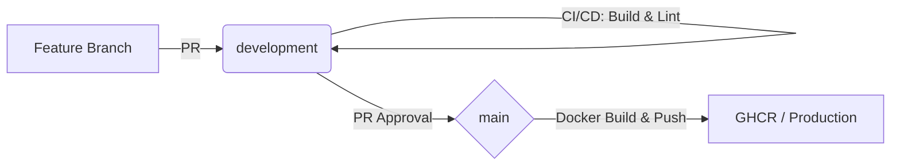

# Nerdlab Front-End // The Digital Singularity 🌌

A interface de vanguarda do ecossistema Nerdlab. Desenvolvida com Next.js 15+, Tailwind CSS e Framer Motion, focada em uma experiência de usuário (UX) editorial, tecnológica e imersiva.

## 🛠️ Tech Stack Core
- **Next.js 15** (Turbopack)
- **Tailwind CSS** (Modern Styling)
- **Framer Motion** (Micro-animações de elite)
- **Lucide React** (Iconografia)
- **TypeScript** (Tipagem Estrita)

## 🔄 Fluxo de Desenvolvimento (Elite Pipeline)

Seguimos um esquema rigoroso de esteiras para garantir que nenhum bug chegue à produção:



1.  **Feature**: Novas features são isoladas em branches `feature/*`.
2.  **Pull Request (Dev)**: Gatilho automático para Build de Produção e `npm run lint`. O CI não aceita avisos (zero warnings).
3.  **HML/Test**: Validação visual e de performance em `development`.
4.  **Production (Main)**: O merge para a main é o passo final antes do deploy via container no servidor.

---

## 🚀 Como Rodar
```bash
npm install
npm run dev
```

## 🛡️ Qualidade & Build
Este projeto utiliza **Zero-Tolerance Linting**. Todas as funções e componentes são tipados rigorosamente para garantir estabilidade e previsibilidade no build do Next.js.
